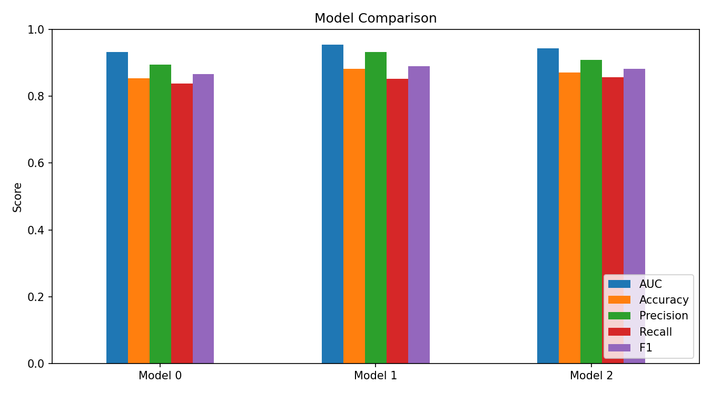
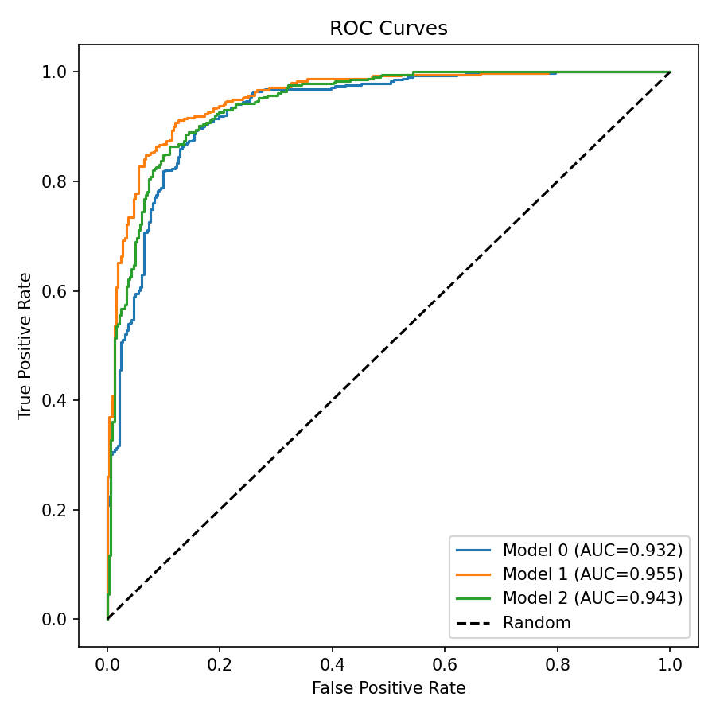
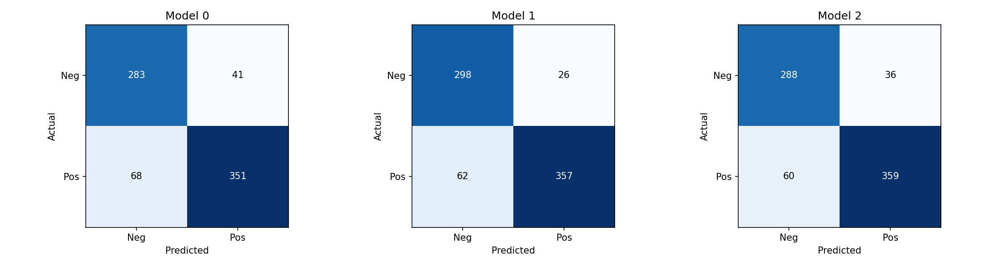
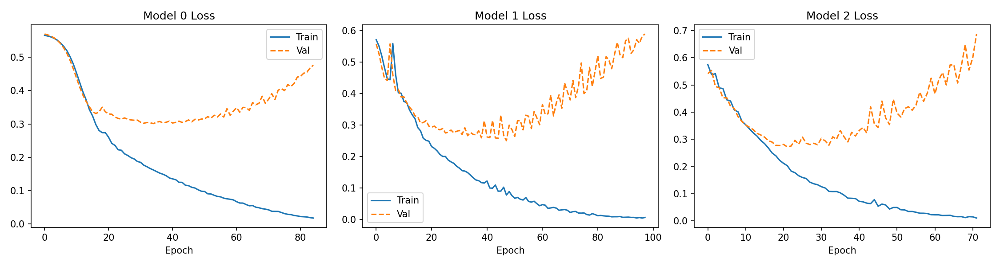
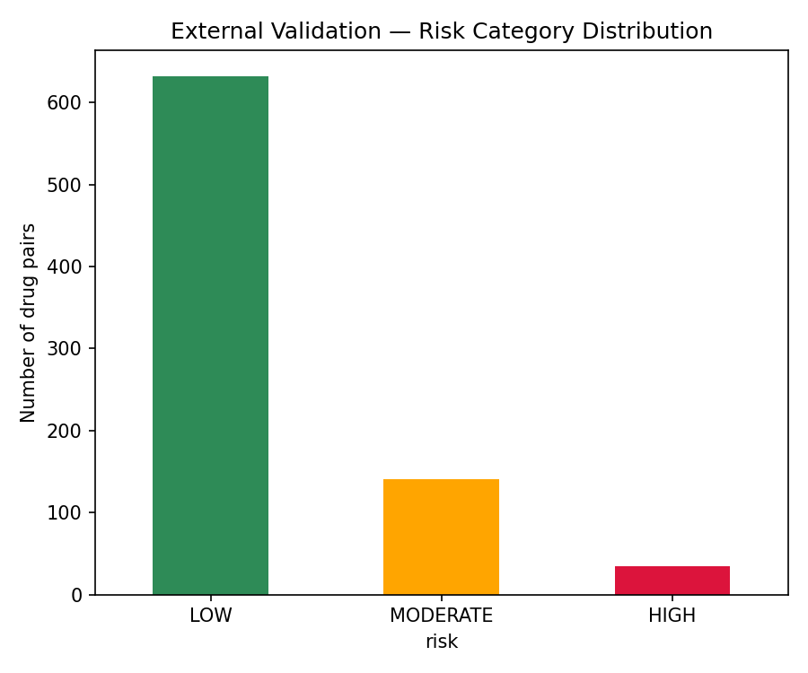

# Drug-Drug-Interaction-Risk-Prediction-GNN

Graph Neural Network-based framework for predicting Drug–Drug Interactions
(DDI) and assessing polypharmacy risk using heterogeneous biomedical graphs
built from DrugBank, STRING, KEGG, SIDER, and UniProt.

## Overview

This project builds three progressively richer GNN models over a 100-drug
subgraph:

- **Model 0** — homogeneous drug-drug graph, drug features only (Morgan
  fingerprints + molecular descriptors)
- **Model 1** — heterogeneous graph adding drug-target, drug-enzyme,
  protein-protein interaction (STRING), and protein-pathway (KEGG) edges
- **Model 2** — Model 1 plus drug-side-effect (SIDER) and protein-GO-term
  (UniProt) edges

Because DrugBank does not label non-interacting drug pairs, this project
uses **PU (Positive-Unlabeled) learning**: a temporary classifier scores
all "unknown" drug pairs, and pairs scoring below a safety threshold
(0.30) become reliable negatives for training. The train/validation/test
split happens **before** PU learning runs, so the reliable-negative
selection never sees validation or test pairs — this avoids a subtle
leakage issue where the PU classifier could otherwise "learn" from
pairs it's later evaluated against.

Validation and test sets are evaluated against untouched "unknown" pairs
as a proxy for true negatives, not literature-confirmed negatives — this
is standard practice for PU learning problems, but it means these numbers
describe model discrimination ability, not clinical ground truth.

## Results

| Metric | Model 0 | Model 1 | Model 2 |
|---|---|---|---|
| AUC | 0.9317 | **0.9551** | 0.9427 |
| Accuracy | 0.8533 | **0.8816** | 0.8708 |
| Precision | 0.8954 | **0.9321** | 0.9089 |
| Recall | 0.8377 | 0.8520 | **0.8568** |
| F1 | 0.8656 | **0.8903** | 0.8821 |
| Brier score | 0.1040 | **0.0900** | 0.0948 |

Model 1 (protein/pathway enrichment) gave the best overall performance in
this run. Model 2's additional side-effect and GO-term edges did not
improve on Model 1 here — most plausibly because a 100-drug graph is too
small for the added parameters to pay off; this is reported as a genuine
finding rather than a bug.

All probabilities are calibrated with temperature scaling (fit on the
validation set) before being used for risk categorization or reported
as metrics.
## Visualizations







## Methodology

1. **Data extraction** — parse DrugBank's `full_database.xml` for the
   selected 100 drugs: names, SMILES, known DDI pairs, drug-target and
   drug-enzyme relationships.
2. **Feature engineering** — 2048-bit Morgan fingerprints (radius 2) +
   4 molecular descriptors (MolWt, LogP, H-bond donors/acceptors) per
   drug.
3. **PU learning** — split first, then train a temporary classifier on
   training-only positive/unknown pairs; select reliable negatives at a
   0.30 safety threshold.
4. **Model training** — GraphSAGE (Model 0) / HeteroConv with SAGEConv
   per relation (Models 1–2), trained with `BCEWithLogitsLoss` (class
   balanced via `pos_weight`), weight decay, and gradient clipping.
5. **Calibration** — temperature scaling fit on validation logits,
   applied to every reported probability.
6. **Evaluation** — AUC, accuracy, precision, recall, F1, Brier score on
   held-out test pairs.
7. **External validation & polypharmacy engine** — score
   previously-unseen drug pairs and multi-drug regimens, categorize risk
   as LOW / MODERATE / HIGH.

## Repository contents

| File | Description |
|---|---|
| `GNN_PROJECT.ipynb` | Full pipeline: data extraction → features → PU learning → Models 0/1/2 → evaluation → external validation → polypharmacy engine |
| `drug_nodes.csv`, `protein_nodes.csv` | Node lists for the 100 selected drugs and their associated proteins |
| `drug_target_edges.csv`, `drug_enzyme_edges.csv` | Drug-protein relationships from DrugBank |
| `string_ppi_edges.csv` | Protein-protein interactions (STRING, confidence ≥ 700) |
| `protein_pathway_edges.csv` | Protein-pathway membership (KEGG) |
| `drug_side_effect_edges.csv` | Drug-side-effect associations (SIDER) |
| `protein_go_edges.csv` | Protein-GO-term annotations (UniProt) |
| `drug_features_2052.pt` | Precomputed 100 × 2052 drug feature matrix |
| `drug_index_mapping.json` | Maps internal model indices back to DrugBank IDs |
| `reliable_negative_train_pairs.csv` | Pairs selected as reliable negatives by PU learning |
| `model0/1/2_state_dict.pt` | Trained model weights |
| `final_model_metrics.csv` | Comparison table above, as CSV |
| `experiment_settings.json` | Seed, thresholds, split sizes for reproducibility |
| `plots/` | ROC curves, loss curves, confusion matrices, risk distribution |

## How to run this yourself

DrugBank's `full_database.xml` is **not included** in this repository —
its license does not permit redistribution. To reproduce this pipeline:

1. Get your own DrugBank academic-license export of `full_database.xml`.
2. Provide a `drug_list.csv` with the 100 drug names/IDs you want to
   study (column named `drug_id`, `drugbank_id`, `drug_name`, or `name`).
3. Place both files in Google Drive.
4. Open `GNN_PROJECT.ipynb` in Google Colab and run all cells top to
   bottom.
5. Install dependencies first if running outside Colab:
```bash
   pip install -r requirements.txt
```

## Limitations

- Validation/test negatives are unlabeled-pair proxies, not
  literature-confirmed non-interactions — treat metrics as a measure of
  ranking ability, not clinical accuracy.
- Limited to a 100-drug subgraph; results may not generalize to the
  full DrugBank interaction space.
- Not intended for clinical use. This is a research/educational project.

## License

MIT License — see `LICENSE`. This applies to the code and derived data
in this repository only, not to DrugBank, STRING, KEGG, SIDER, or
UniProt data, which remain governed by their respective source licenses.
